## DSO101: Continuous Integration and Continuous Deployment - Final Project

This project sets up a DevSecOps pipeline for a PERN stack app (PostgreSQL, Express, React, Node.js) with a BMI Calculator. It uses only free cloud tools to show how modern CI/CD works.

Tools used:

1. Jenkins: Runs locally to sync code with GitHub

2. GitHub Actions: Builds Docker images and deploys automatically

3. Docker Hub: Stores the Docker images

4. Render: Hosts the app online

The main goal is to automate everything  from writing code to testing, building, and deploying — without spending money.


### Main Components Used (Frontend):

#### BMI Calculator Component (React + TypeScript) : 

1. Uses useState for managing input and results

2. Simple form with input validation

3. Talks to backend API, but can also calculate locally if API fails

4. Shows loading and error messages when needed


#### Key Features:

1. Input Validation

2. Height must be between 50–300 cm

3. Weight must be between 10–500 kg

4. Age must be between 1–120 years

Output : 

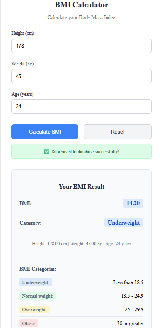


### BMI Calculator Backend : 

This is a Node.js + Express backend for calculating and saving BMI data using a PostgreSQL database.

#### Features

1. Calculate BMI from height and weight

2. Save BMI records with user info

3. Get BMI history and latest record

4. API with validation and error handling

#### Tech Stack 

1. Node.js, Express.js, TypeScript

2. PostgreSQL with Knex.js

3. Jest & Supertest for testing


####  Setup 

1. Install dependencies

2. Set up .env file: 

```
DATABASE_HOST=localhost
DATABASE_PORT=5432
DATABASE_USER=postgres
DATABASE_PASSWORD=Tenzin@2005
DATABASE_NAME=dso101_project

```

3. Create database & run migration: 

```
CREATE TABLE IF NOT EXISTS bmi_record (
      id SERIAL PRIMARY KEY,
      user_id INT NOT NULL,
      height DECIMAL(5,2) NOT NULL,
      weight DECIMAL(5,2) NOT NULL,
      bmi DECIMAL(4,2) NOT NULL,
      category VARCHAR(255) NOT NULL,
      notes TEXT,
      created_at TIMESTAMP DEFAULT CURRENT_TIMESTAMP,
      updated_at TIMESTAMP DEFAULT CURRENT_TIMESTAMP,
      UNIQUE (id)
    );
  `)
}

```
After creating the database, run:


```
npx knex migrate:latest
```

This command connects to PostgreSQL (using knexfile.js), checks which migrations haven't been run yet, and applies them. It sets up the tables (like bmi_record) as defined in the migration files.

Output :

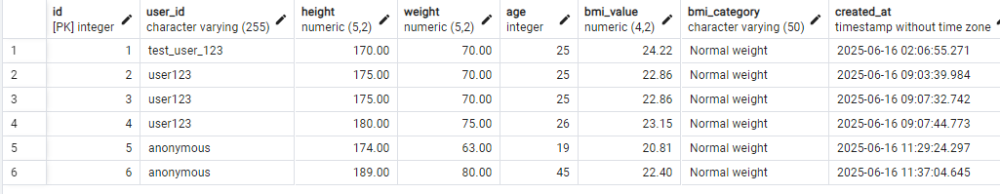

### API Endpoints


#### POST /api/bmi
Saves BMI record to database.
```
{
  "height": 175,
  "weight": 70,
  "age": 25,
  "user_id": "user123"
}

```

2. Get BMI History
```
GET /api/bmi?user_id=user123&limit=10
```
Returns a list of past BMI records for a user, sorted by most recent first.


3. Get Latest BMI Record
```
GET /api/bmi/latest?user_id=user123
```
Fetches the most recent BMI record.

4. Calculate BMI Only (no save)
```
POST /api/bmi/calculate
```
Calculates and returns BMI and category without storing it in the database.
```
{
  "height": 175,
  "weight": 70
}
```

output : 

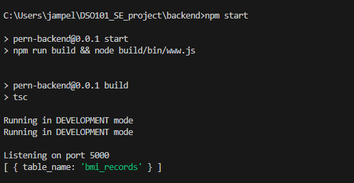

### BMI Categories:

1. Underweight: BMI < 18.5

2. Normal weight: 18.5 – 24.9

3. Overweight: 25.0 – 29.9

4. Obese: BMI ≥ 30.0


### API Integration ( backend + frontend )

1. The frontend sends user data to the backend using calculateAndSaveBMI.

2. If the backend fails, it uses a local function to calculate BMI.

3. Shows success or error messages to the user.

4. BMI is calculated using the formula and shows category: Underweight, Normal, Overweight, or Obese.

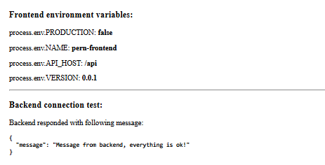

The message indicates that backend and frontend are Sucessfully Connected.

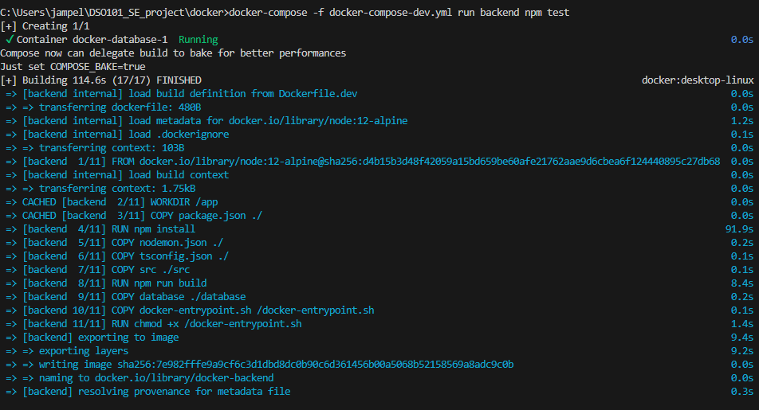


### Stage 1: Docker Configuration

#### Containerization Strategy : 

1. Backend Dockerfile :

```
FROM node:12-alpine

WORKDIR /app
ENV NODE_OPTIONS=--max_old_space_size=4096

COPY package.json ./

# Install all dependencies (dev + prod)
RUN npm install

COPY nodemon.json ./
COPY tsconfig.json ./
COPY src ./src

RUN npm run build

COPY database ./database

COPY docker-entrypoint.sh /docker-entrypoint.sh
RUN chmod +x /docker-entrypoint.sh

ENTRYPOINT [ "/docker-entrypoint.sh" ]
CMD [ "npm", "run", "serve" ]

```


2. Frontend dockerfile :

```
# Development environment

FROM node:18


# Set app directory
WORKDIR /app

# Environment variables
ENV NODE_OPTIONS=--max_old_space_size=4096
ENV PATH /app/node_modules/.bin:$PATH

# Install with legacy peer deps to resolve ESLint conflict
COPY package.json ./
COPY sync-package-lock ./
# Use --legacy-peer-deps to resolve the eslint version conflict
RUN npm install --legacy-peer-deps

# Development server
COPY src ./src
COPY public ./public
COPY .eslintrc.js ./
COPY tsconfig.json ./
COPY webpack.config.ts ./

# This is responsible of copying node_modules and package-lock.json to host machine
COPY docker-entrypoint.sh /docker-entrypoint.sh
RUN chmod +x /docker-entrypoint.sh
ENTRYPOINT [ "/docker-entrypoint.sh" ]

CMD [ "npm", "start" ]

```


As part of Stage 1, I configured Docker and docker-compose-dev.yml to support the BMI calculator service. This included adding volumes for BMI data and running tests via Docker Compose.

#### Issue Faced:

While running the test using:
```
docker-compose -f docker-compose-dev.yml run backend npm test

```

I encountered the following error:
```
exec /docker-entrypoint.sh: no such file or directory
exit status 255

```

#### Output:

Despite the error, the Docker image built successfully, as shown in the output screenshot below:


### Stage 2: Jenkins Pipeline Setup

I Set up a local Jenkins pipeline to automatically push code to GitHub when the latest commit message contains @push.

#### Pipeline Job

Created Jenkins pipeline job named: **02230307_app_pipeline**

Integrated the following stages in the Jenkinsfile:

1. Check Commit Message – Triggers push only if @push is present.

2. Checkout, Build Frontend/Backend – Installs dependencies and builds the app.

3.  Test – Section provided for frontend/backend test execution (commented).

4. Push to GitHub – Executes only when @push is detected in the latest commit.


### Credential Management
GitHub PAT credentials added:

1. ID: github-credentials
2. Scope: Global
3. Used in pipeline to configure remote and authenticate git push.

in jenkins file :

```
pipeline {
    agent any
    
    environment {
        // Store GitHub credentials in Jenkins Secrets
        GITHUB_CREDS = credentials('github-credentials')
        REPO_URL = 'https://github.com/Eyemusican/DSO101_SE_project.git'
    }
    
```
### Store in Jenkins Credentials 
Manage Jenkins → Credentials → System → Global Credentials :

Add new credentials:

1. Kind: Username and Password

2. ID: github-credentials

3. Username: Your GitHub username

4. Password: Your generated Personal Access Token

This allows Jenkins to push code securely to your GitHub repository.

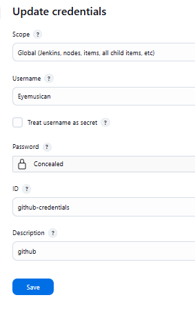

### Create Personal Access Token (PAT)

1. GitHub → Settings → Developer Settings → Personal Access Tokens

2. Generate a token with repo scope (recommended: classic token)

3. This token acts as your GitHub password for Jenkins (Password: Your generated Personal Access Token for above  )

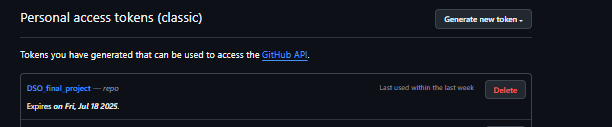


### Testing the Pipeline
Made two commits:

1. One without @push → Push stage skipped

2. One with @push → Jenkins automatically pushed code to GitHub

Confirmed working GitHub integration and conditional automation

#### Outputs : 
Without push :

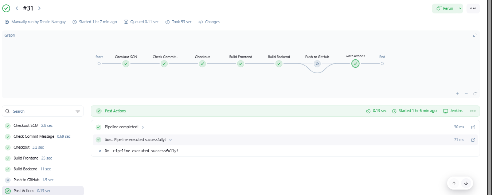

With push :


### Stage 3: GitHub Actions CI/CD
Automated Docker Build Pipeline
Created .github/workflows/ci-cd.yml:

```
name: Docker Build and Push

on:
  push:
    branches:
      - main
      - develop
  pull_request:
    branches:
      - main
      - develop

env:
  FRONTEND_IMAGE: ${{ secrets.DOCKERHUB_USERNAME }}/pern-frontend
  BACKEND_IMAGE: ${{ secrets.DOCKERHUB_USERNAME }}/pern-backend
  DOCKER_BUILDKIT: 1

jobs:
  build-and-push:
    runs-on: ubuntu-latest
    
    steps:
      - name: Checkout code
        uses: actions/checkout@v4
        with:
          fetch-depth: 0

      - name: Set up Docker Buildx
        uses: docker/setup-buildx-action@v3
        with:
          buildkitd-flags: --debug

      - name: Cache Docker layers
        uses: actions/cache@v3
        with:
          path: /tmp/.buildx-cache
          key: ${{ runner.os }}-buildx-${{ github.sha }}
          restore-keys: |
            ${{ runner.os }}-buildx-

      - name: Login to Docker Hub
        uses: docker/login-action@v3
        with:
          username: ${{ secrets.DOCKERHUB_USERNAME }}
          password: ${{ secrets.DOCKERHUB_TOKEN }}

      - name: Build and push Frontend image
        uses: docker/build-push-action@v5
        with:
          context: ./frontend
          file: ./frontend/Dockerfile.prod
          push: ${{ github.event_name != 'pull_request' }}
          tags: |
            ${{ env.FRONTEND_IMAGE }}:latest
            ${{ env.FRONTEND_IMAGE }}:${{ github.sha }}
          cache-from: |
            type=local,src=/tmp/.buildx-cache
            type=registry,ref=${{ env.FRONTEND_IMAGE }}:latest
          cache-to: type=local,dest=/tmp/.buildx-cache-new,mode=max

      - name: Build and push Backend image  
        uses: docker/build-push-action@v5
        with:
          context: ./backend
          file: ./backend/Dockerfile.prod
          push: ${{ github.event_name != 'pull_request' }}
          tags: |
            ${{ env.BACKEND_IMAGE }}:latest
            ${{ env.BACKEND_IMAGE }}:${{ github.sha }}
          cache-from: |
            type=local,src=/tmp/.buildx-cache
            type=registry,ref=${{ env.BACKEND_IMAGE }}:latest
          cache-to: type=local,dest=/tmp/.buildx-cache-new,mode=max

      # Temp fix for cache
      - name: Move cache
        run: |
          rm -rf /tmp/.buildx-cache
          mv /tmp/.buildx-cache-new /tmp/.buildx-cache
```

#### Security Integration : 

1. Added Docker Hub username and token as secrets in the GitHub repo (Settings → Actions → Secrets and Variables)

2. Used these secrets in GitHub Actions for secure Docker image login and push

3. Successfully tested secret access during workflow runs

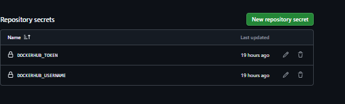


Output : 

The Docker build and push workflow (docker-build.yml) ran successfully after a commit to the main branch.

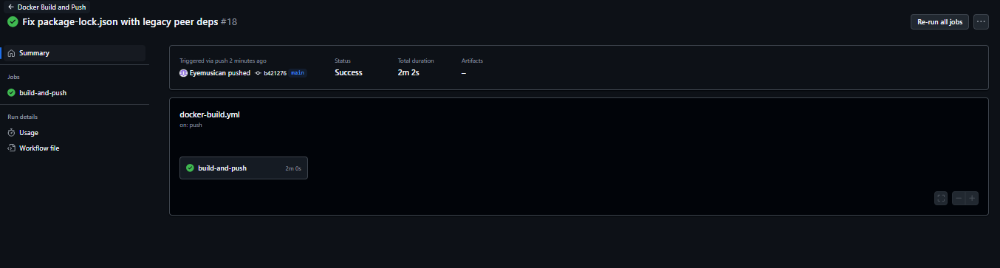


#### Stage 3: Deploy to Render 
Objective: Deploy services to Render.


 I Created a PostgreSQL Database on Render.
- I   Copied the database credentials: host, port, name, username, and password.

Deployed the Backend Service:

- Selected "Deploy an existing image" option.

- Used Docker image: eyemusician/pern-backend

- Added the required environment variables:

- - DATABASE_HOST, DATABASE_PORT, DATABASE_USER, DATABASE_PASSWORD, DATABASE_NAME

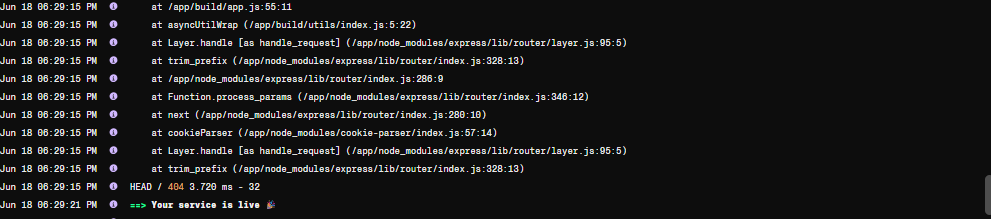


https://pern-backend-ommc.onrender.com

Fronte-end deployment error :

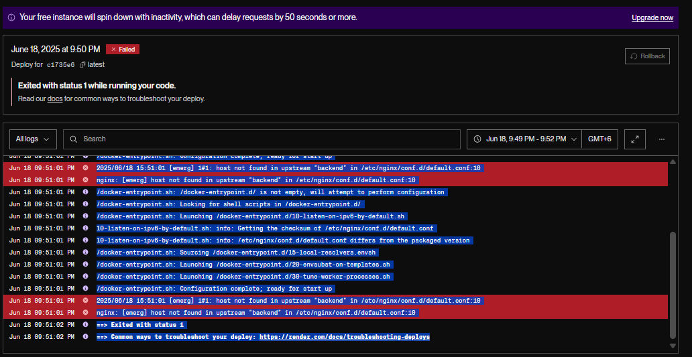

My frontend deployment on Render failed because the Nginx server inside the Docker image was trying to connect to a service named backend, which couldn't be found. This error happens because the name backend is valid only in Docker Compose (where services share a network). On Render, services are deployed separately and must be accessed using their actual Render URLs. Since I didn't update the Nginx config or frontend API endpoint to point to the correct backend URL on Render, it caused the deployment to crash with a "host not found" error.


